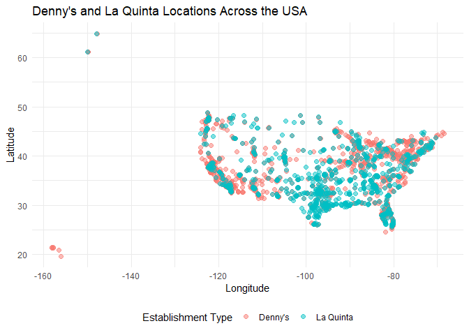
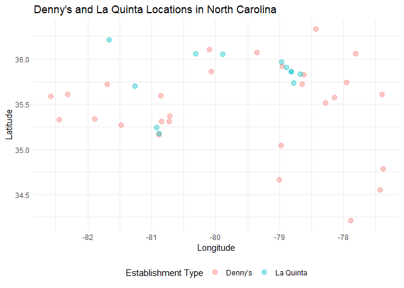
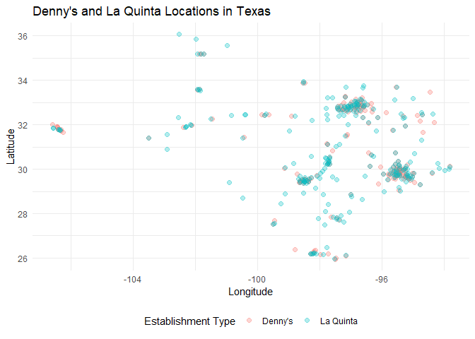

Lab 04 - La Quinta is Spanish for next to Denny’s, Pt. 1
================
Jamieson Nathan
07/02/2025

### Load packages and data

``` r
library(tidyverse) 
library(dsbox) 
```

``` r
states <- read_csv("data/states.csv")
```

### Exercise 1

``` r
dim(dennys) 
```

    ## [1] 1643    6

``` r
head(dennys) 
```

    ## # A tibble: 6 × 6
    ##   address                        city       state zip   longitude latitude
    ##   <chr>                          <chr>      <chr> <chr>     <dbl>    <dbl>
    ## 1 2900 Denali                    Anchorage  AK    99503    -150.      61.2
    ## 2 3850 Debarr Road               Anchorage  AK    99508    -150.      61.2
    ## 3 1929 Airport Way               Fairbanks  AK    99701    -148.      64.8
    ## 4 230 Connector Dr               Auburn     AL    36849     -85.5     32.6
    ## 5 224 Daniel Payne Drive N       Birmingham AL    35207     -86.8     33.6
    ## 6 900 16th St S, Commons on Gree Birmingham AL    35294     -86.8     33.5

Dimensions are 1643 X 6. Each row represents a specific Denny’s location
and the columns give the identifying information.

### Exercise 2

``` r
dim(laquinta) 
```

    ## [1] 909   6

``` r
head(laquinta) 
```

    ## # A tibble: 6 × 6
    ##   address                    city         state zip   longitude latitude
    ##   <chr>                      <chr>        <chr> <chr>     <dbl>    <dbl>
    ## 1 793 W. Bel Air Avenue      "\nAberdeen" MD    21001     -76.2     39.5
    ## 2 3018 CatClaw Dr            "\nAbilene"  TX    79606     -99.8     32.4
    ## 3 3501 West Lake Rd          "\nAbilene"  TX    79601     -99.7     32.5
    ## 4 184 North Point Way        "\nAcworth"  GA    30102     -84.7     34.1
    ## 5 2828 East Arlington Street "\nAda"      OK    74820     -96.6     34.8
    ## 6 14925 Landmark Blvd        "\nAddison"  TX    75254     -96.8     33.0

909 X 6, each row represents the location of a Laquinta and the columns
give the identifying information.

### Exercise 3

Looking at the websites the data is scraped from, there appear to be
numerous overseas locations for both chains (including Asia, Africa, and
Europe).

### Exercise 4

Filtering both datasets by states seems like the best move.Lets have a
look at the states dataset to doublecheck it has abbreviations:

``` r
dim(states) 
```

    ## [1] 51  3

``` r
head(states) 
```

    ## # A tibble: 6 × 3
    ##   name       abbreviation    area
    ##   <chr>      <chr>          <dbl>
    ## 1 Alabama    AL            52420.
    ## 2 Alaska     AK           665384.
    ## 3 Arizona    AZ           113990.
    ## 4 Arkansas   AR            53179.
    ## 5 California CA           163695.
    ## 6 Colorado   CO           104094.

### Exercise 5

``` r
dennys %>%
  filter(!(state %in% states$abbreviation))
```

    ## # A tibble: 0 × 6
    ## # ℹ 6 variables: address <chr>, city <chr>, state <chr>, zip <chr>,
    ## #   longitude <dbl>, latitude <dbl>

There appear to be no Denny’s outside of the US (based on this data
scrape).

### Exercise 6

``` r
dennys <- dennys %>%
  mutate(dn_country = "United States")
```

### Exercise 7

``` r
laquinta %>%
  filter(!(state %in% states$abbreviation))
```

    ## # A tibble: 14 × 6
    ##    address                                  city  state zip   longitude latitude
    ##    <chr>                                    <chr> <chr> <chr>     <dbl>    <dbl>
    ##  1 Carretera Panamericana Sur KM 12         "\nA… AG    20345    -102.     21.8 
    ##  2 Av. Tulum Mza. 14 S.M. 4 Lote 2          "\nC… QR    77500     -86.8    21.2 
    ##  3 Ejercito Nacional 8211                   "Col… CH    32528    -106.     31.7 
    ##  4 Blvd. Aeropuerto 4001                    "Par… NL    66600    -100.     25.8 
    ##  5 Carrera 38 # 26-13 Avenida las Palmas c… "\nM… ANT   0500…     -75.6     6.22
    ##  6 AV. PINO SUAREZ No. 1001                 "Col… NL    64000    -100.     25.7 
    ##  7 Av. Fidel Velazquez #3000 Col. Central   "\nM… NL    64190    -100.     25.7 
    ##  8 63 King Street East                      "\nO… ON    L1H1…     -78.9    43.9 
    ##  9 Calle Las Torres-1 Colonia Reforma       "\nP… VE    93210     -97.4    20.6 
    ## 10 Blvd. Audi N. 3 Ciudad Modelo            "\nS… PU    75010     -97.8    19.2 
    ## 11 Ave. Zeta del Cochero No 407             "Col… PU    72810     -98.2    19.0 
    ## 12 Av. Benito Juarez 1230 B (Carretera 57)… "\nS… SL    78399    -101.     22.1 
    ## 13 Blvd. Fuerza Armadas                     "con… FM    11101     -87.2    14.1 
    ## 14 8640 Alexandra Rd                        "\nR… BC    V6X1…    -123.     49.2

### Exercise 8

``` r
laquinta <- laquinta %>%
  mutate(country = case_when(
    state %in% state.abb ~ "United States",  # Ensure 'state.abb' is defined or replace it with appropriate state codes.
    state %in% c("ON", "BC") ~ "Canada",
    state == "ANT" ~ "Colombia",
    state %in% c("AG", "QR", "CH", "NL", "VE", "PU", "SL") ~ "Mexico", 
    state == "FM" ~ "Honduras"
  )) %>%
  filter(country == "United States")
```

# Exercise 9

``` r
dennys_count <- dennys %>%
  count(state) %>%
  inner_join(states, by = c("state" = "abbreviation"))

laquinta_count <- laquinta %>%
  count(state) %>%
  inner_join(states, by = c("state" = "abbreviation"))
```

``` r
dennys_most <- filter(dennys_count, n == max(n))
dennys_fewest <- filter(dennys_count, n == min(n))

laquinta_most <- filter(laquinta_count, n == max(n))
laquinta_fewest <- filter(laquinta_count, n == min(n))

print(dennys_most)
```

    ## # A tibble: 1 × 4
    ##   state     n name          area
    ##   <chr> <int> <chr>        <dbl>
    ## 1 CA      403 California 163695.

``` r
print(dennys_fewest)
```

    ## # A tibble: 1 × 4
    ##   state     n name      area
    ##   <chr> <int> <chr>    <dbl>
    ## 1 DE        1 Delaware 2489.

``` r
print(laquinta_most)
```

    ## # A tibble: 1 × 4
    ##   state     n name     area
    ##   <chr> <int> <chr>   <dbl>
    ## 1 TX      237 Texas 268596.

``` r
print(laquinta_fewest)
```

    ## # A tibble: 1 × 4
    ##   state     n name    area
    ##   <chr> <int> <chr>  <dbl>
    ## 1 ME        1 Maine 35380.

Cali/Delaware have the most/fewest Denny’s locations respectively,
whereas, Texas/Maine have the same for Laquinta. Not too surprising,
given Ca And Tx are typically the most popular states and the other two
are much less populated.

# Exercise 10

``` r
dennys_density <- dennys %>%
  count(state) %>%
  inner_join(states, by = c("state" = "abbreviation")) %>%
  mutate(density_per_thousand_sq_mi = n / (area / 1000))  

dennys_most_dense <- dennys_density %>%
  arrange(desc(density_per_thousand_sq_mi)) %>%
  slice(1)

dennys_least_dense <- dennys_density %>%
  arrange(density_per_thousand_sq_mi) %>%
  slice(1)

laquinta_density <- laquinta %>%
  count(state) %>%
  inner_join(states, by = c("state" = "abbreviation")) %>%
  mutate(density_per_thousand_sq_mi = n / (area / 1000))  

laquinta_most_dense <- laquinta_density %>%
  arrange(desc(density_per_thousand_sq_mi)) %>%
  slice(1)

laquinta_least_dense <- laquinta_density %>%
  arrange(density_per_thousand_sq_mi) %>%
  slice(1)

print(dennys_most_dense)
```

    ## # A tibble: 1 × 5
    ##   state     n name                  area density_per_thousand_sq_mi
    ##   <chr> <int> <chr>                <dbl>                      <dbl>
    ## 1 DC        2 District of Columbia  68.3                       29.3

``` r
print(dennys_least_dense)
```

    ## # A tibble: 1 × 5
    ##   state     n name      area density_per_thousand_sq_mi
    ##   <chr> <int> <chr>    <dbl>                      <dbl>
    ## 1 AK        3 Alaska 665384.                    0.00451

``` r
print(laquinta_most_dense)
```

    ## # A tibble: 1 × 5
    ##   state     n name          area density_per_thousand_sq_mi
    ##   <chr> <int> <chr>        <dbl>                      <dbl>
    ## 1 RI        2 Rhode Island 1545.                       1.29

``` r
print(laquinta_least_dense)
```

    ## # A tibble: 1 × 5
    ##   state     n name      area density_per_thousand_sq_mi
    ##   <chr> <int> <chr>    <dbl>                      <dbl>
    ## 1 AK        2 Alaska 665384.                    0.00301

This makes sense, as DC and RI are incredible dense states, so it tracks
that it is the highest and Alaska is the least for both

``` r
dn <- dennys %>%
  mutate(establishment = "Denny's")
lq <- laquinta %>%
  mutate(establishment = "La Quinta")

dn_lq <- bind_rows(dn, lq)
```

``` r
usa_locations_plot <- ggplot(dn_lq, aes(
  x = longitude,
  y = latitude,
  color = establishment
)) +
  geom_point(alpha = 0.5, size = 2) +  
  labs(title = "Denny's and La Quinta Locations Across the USA",
       x = "Longitude",
       y = "Latitude",
       color = "Establishment Type") +
  theme_minimal() +
  theme(legend.position = "bottom")  
print(usa_locations_plot)
```

<!-- --> \# Exercise 11

``` r
nc_locations <- dn_lq %>%
  filter(state == "NC")

nc_locations_plot <- ggplot(nc_locations, aes(
  x = longitude,
  y = latitude,
  color = establishment
)) +
  geom_point(alpha = 0.4, size = 3) +  
  labs(title = "Denny's and La Quinta Locations in North Carolina",
       x = "Longitude",
       y = "Latitude",
       color = "Establishment Type") +
  theme_minimal() +
  theme(legend.position = "bottom")  

print(nc_locations_plot)
```

<!-- -->

Partially, but there are enough standalones to see some variability in
the joke. Although it does seem that where there is a La Quinta, there
is a Dennys’ for the most part.

# Exercise 11

``` r
tx_locations <- dn_lq %>%
  filter(state == "TX")

tx_locations_plot <- ggplot(tx_locations, aes(
  x = longitude,
  y = latitude,
  color = establishment
)) +
  geom_point(alpha = 0.3, size = 2) +  
  labs(title = "Denny's and La Quinta Locations in Texas",
       x = "Longitude",
       y = "Latitude",
       color = "Establishment Type") +
  theme_minimal() +
  theme(legend.position = "bottom")  

print(tx_locations_plot)
```

<!-- --> Now he seems to be pretty
spot on! It is almost uncanny how close these two chains follow each
other here. He must be bilingual.
